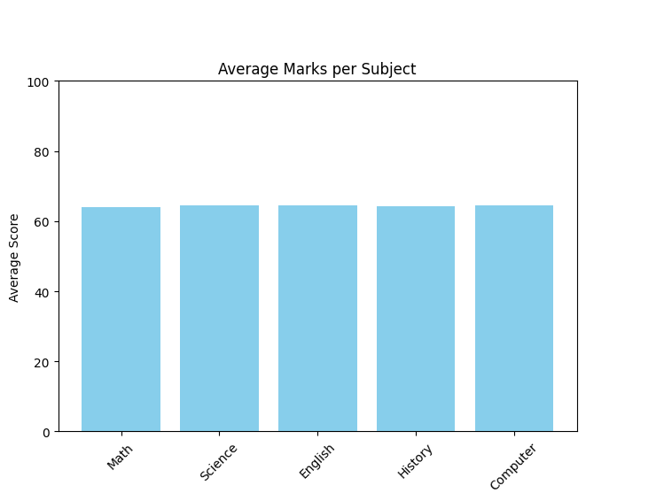
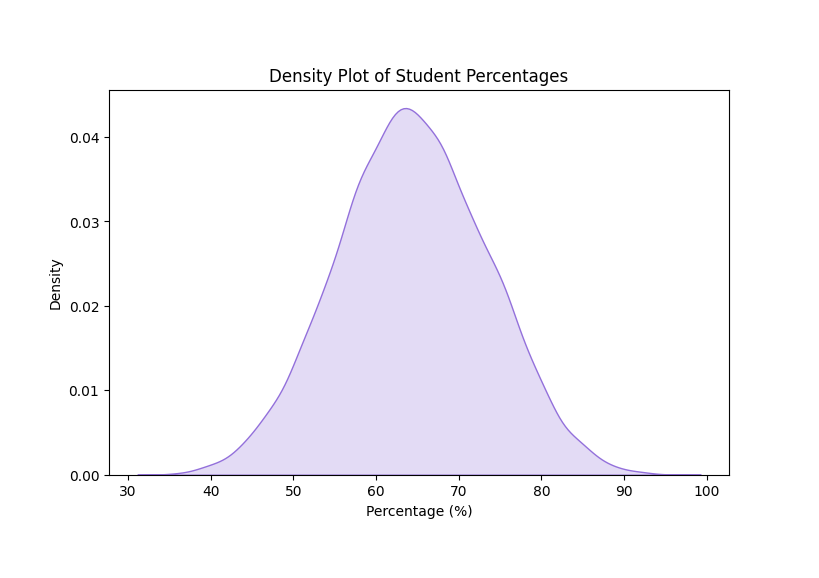
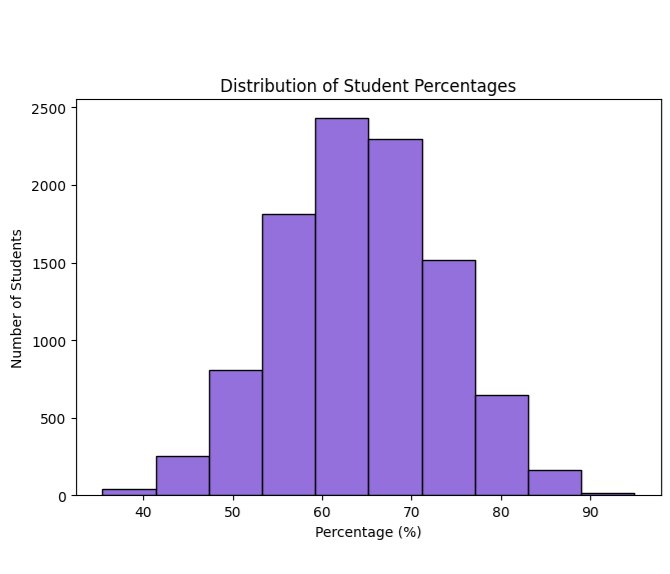
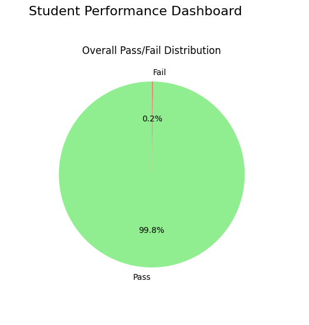
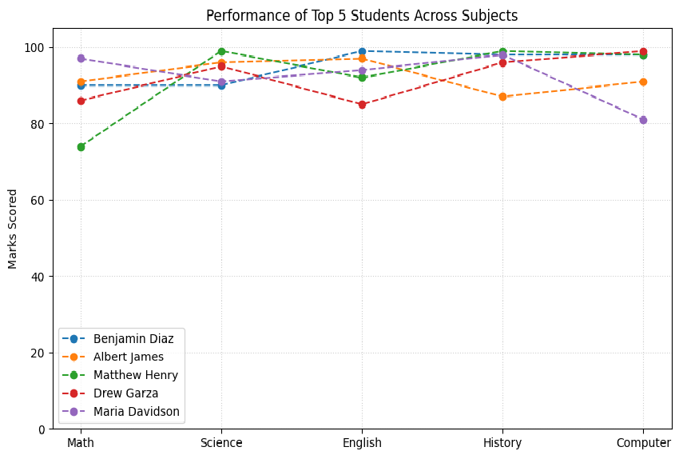

# Student Performance Analyser

## Overview

This project focuses on analyzing student academic performance using data analysis and machine learning techniques. The objective is to identify patterns, visualize insights, and evaluate factors affecting student performance.

---

## Features

* Data preprocessing and cleaning
* Exploratory Data Analysis (EDA)
* Data visualization using charts and graphs
* Student performance analysis
* Predictive analysis using machine learning models

---

## Technologies Used

* Python
* Pandas
* NumPy
* Matplotlib
* Scikit-learn
* Jupyter Notebook

---

## Project Structure

```text
student-performance-analyser
│
├── README.md
├── Student_Performance_Analyser.ipynb
│
├── dataset/
│   └── Dataset files
│
└── images/
    └── Output screenshots and graphs
```

---

## Project Screenshots

### Average Marks


### Density Plot


### Distribution of Percentages


### Student Performance Dashboard


### Top 5 Students


---

## Installation

Clone the repository:

```bash
git clone https://github.com/your-username/student-performance-analyser.git
```

Install required libraries:

```bash
pip install pandas numpy matplotlib scikit-learn jupyter
```

---

## Usage

1. Open the Jupyter Notebook
2. Run all notebook cells
3. Analyze outputs and visualizations

---

## Team Members

This project was developed collaboratively as part of a group academic project.

* Gokul S
* Teena Tom
* Adithya Ajith
* Divyang Patel
* Aishik Mukherjee

---

## License

This project is intended for educational purposes.
